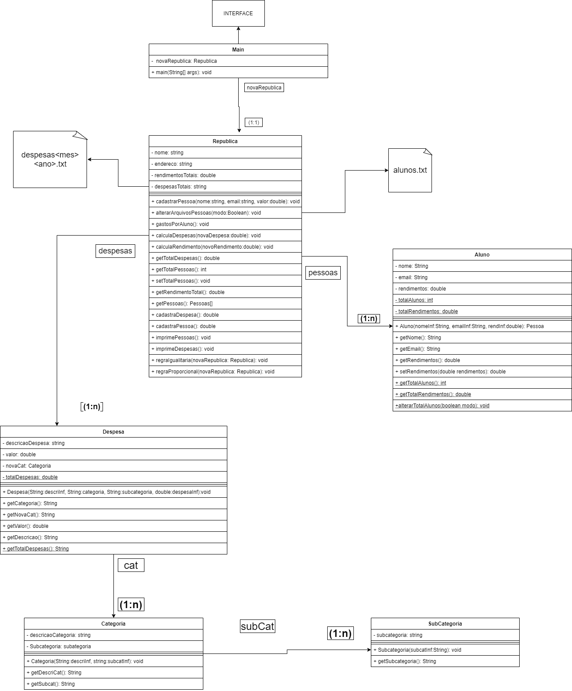
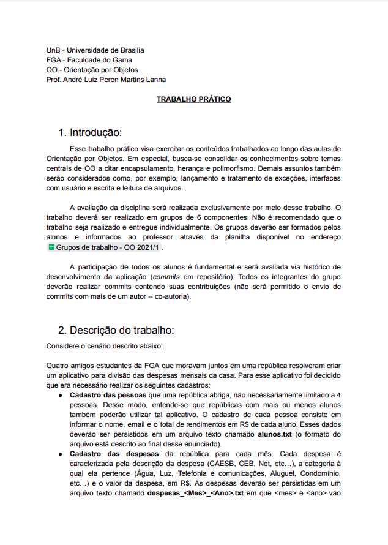
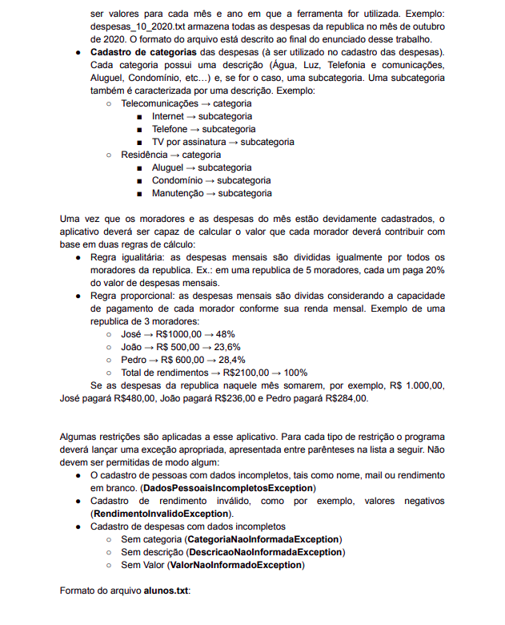
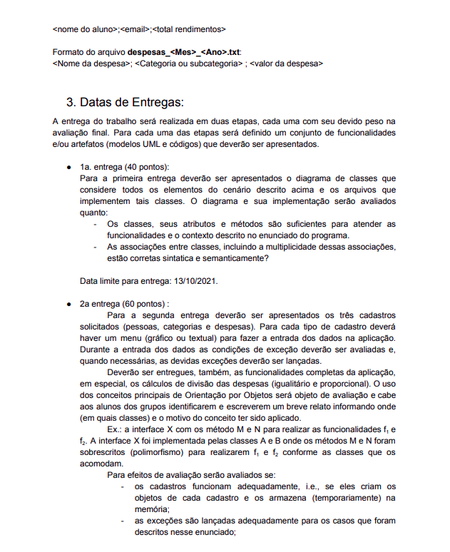
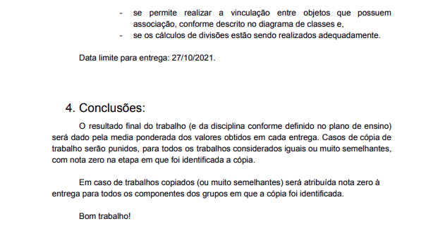

# Orientação a Objeto

## Trabalho final

Trabalho da disciplina Orientação a Objeto

## Integrantes

|Matrícula|Nome|Email|
|---|---|---|
|180113194|Endy Sally Soares Andrade|180113194@aluno.unb.br|
|190055006|Gian Medeiros Rosa|190055006@aluno.unb.br|
|190035935|Nathan Pontes Romão|190035935@aluno.unb.br|
|190116072|Raphaela Guimarães de Araújo dos Santos|190116072@aluno.unb.br|
|190037423|Rhuan Brandão Guedes Silva|190037423@aluno.unb.br|

## Diagrama de Classes

https://app.diagrams.net/#G14TO_bCJz5bud0JUKGlsh6U-lit3eUiPP

## Relatório de Conceitos Usados

Foram criadas 5 classes, sendo elas Aluno, Despesas, Categoria, Subcategoria e República.
Elas são estruturadas da seguinte forma:

### Classe Aluno

Encapsulada como pública, ou seja, pertencente a todo o objeto;  
Criada como um método construtor para as variáveis “nome, email e rendimento”;  
As funções get (Nome, Email, Rendimentos) são públicas e pertencentes a todo o objeto;  
As variáveis nome e email são privadas, sendo assim, pertencentes apenas a classe Alunos;  
As funções get (totalAluno e totalRendimentos) são privadas e estáticas, isto é, pertencentes apenas à classe Aluno e comum a todos os objetos dessa classe;   
A função ‘to string’ foi sobrescrita a partir do polimorfismo. 

### Classe Categoria

Encapsulada como pública, ou seja, pertencente a todo o objeto;
Faz uso da classe Subcategoria já existente no objeto, para armazenar novas subcategorias dentro de Categoria;
As funções são públicas e pertencentes a todo o objeto;
As funções Subcat, DescricaoCat e get DesriCat, são públicas e pertencentes a todo o objeto;

### Classe Subcategoria

Encapsulada como pública, ou seja, pertencente a todo o objeto;
Os objetos usados em Subcategoria são compartilhados com Categoria;

### Classe Despesa

Encapsulada como pública, isto é, pertencente a todo o objeto;
Criada como um método construtor para as variáveis “descriInf, categoria, subcategoria e despesaInf”;
As variáveis descricaoDespesa, valor, Categoria e novaCat são privadas, pertencentes apenas a classe Despesa;
A variável totalDespesa é privada e estática, isto é, pertencentes apenas à classe Despesa e sendo assim comum a todos os objetos dessa classe;
Faz uso da classe Subcategoria já existente no objeto, onde a variável novaCat armazenar novas subcategorias dentro de Despesa;
As funções ‘to string’ foram sobrescritas a partir do polimorfismo. 

### Classe Republica

Encapsulada como pública, isto é, pertencente a todo o objeto;
As variáveis arquivoAlunos e arquivosDespesas são públicas e pertencentes a todo o objeto;
As variáveis mês, ano são privadas e pertencentes apenas a classe Republica;
As variáveis CategoriaNaoInformada, DescricaoNaoInformada, ValorNaoInformado, DadosPessoaisIncompletos, RendimentoInvalido são exceções.

## Enunciado do trabalho

